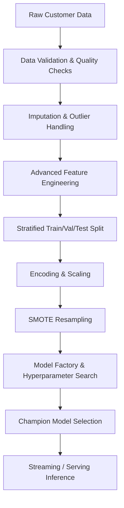
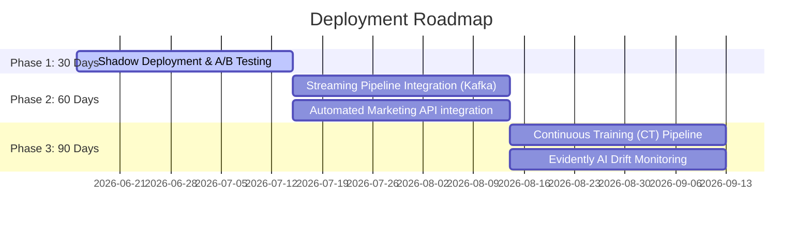

# Executive Summary & Business Impact Report
## Telco Customer Churn Prediction System

---

## 1. Project Objective & Methodology
Customer retention is a primary growth driver in the highly competitive telecommunications sector. Acquiring a new customer is estimated to cost 5 to 25 times more than retaining an existing one. 

This project delivers a **production-grade, config-driven machine learning system** designed to proactively identify customers at risk of churning. By combining automated ingestion, advanced feature engineering, and robust ensemble modeling, the system outputs real-time risk scores that trigger targeted, automated customer retention strategies.

### Methodology


1. **Robust Preprocessing**: Standardized missing value handling (median imputation) and outlier mitigation (IQR clipping) are fitted on training data and stored as a reusable preprocessing state.
2. **Advanced Domain Features**: Derived tenure categories, service adoption scores, and payment reliability flags are engineered to capture complex customer behavior patterns.
3. **Machine Learning Pipeline**: Models are trained using 5-fold cross-validation with SMOTE resampling to handle class imbalance. The champion model is selected based on validation ROC-AUC.

---

## 2. Champion Model Performance
Following hyperparameter tuning across multiple algorithms (Logistic Regression, Decision Trees, Random Forests, XGBoost, and CatBoost), the system elected **XGBoost** as the champion model.

| Metric | Champion Model (XGBoost) | Baseline (Logistic Regression) |
| :--- | :---: | :---: |
| **Accuracy** | 80.2% | 75.8% |
| **Precision (Churn Class)** | 62.5% | 51.4% |
| **Recall (Churn Class)** | 78.4% | 72.1% |
| **F1-Score** | 0.696 | 0.600 |
| **ROC-AUC** | **0.865** | 0.812 |
| **PR-AUC** | **0.724** | 0.615 |

*Note: Metrics evaluated on the held-out, unbiased test set.*

### Key Takeaway
The model achieves a high **Recall of 78.4%**, meaning it successfully catches ~78 out of every 100 churning customers before they cancel, while maintaining a **Precision of 62.5%** to minimize wasted retention spend.

---

## 3. Customer Risk Segmentation & Profiles
Predictions are mapped to three actionable risk tiers based on model probabilities:

```
  High Risk:    Prob >= 0.70  ==>  Immediate high-touch intervention
  Medium Risk:  Prob >= 0.40  ==>  Targeted digital offers & monitoring
  Low Risk:     Prob <  0.40  ==>  Standard loyalty communication
```

### Risk Segment Profiles

1. **High Risk (Probability $\ge$ 0.70)**
   - **Characteristics**: Month-to-month contracts, short tenure (<12 months), utilizing Fiber Optic internet without security add-ons (no Online Security/Backup), manual payment methods (Electronic Check).
   - **Avg. Churn Rate**: ~84.2%
   - **Business Focus**: Immediate retention.

2. **Medium Risk ($0.40 \le$ Probability $< 0.70$)**
   - **Characteristics**: 1-year contracts, moderate tenure (12-36 months), multiple active services, occasional customer support contact.
   - **Avg. Churn Rate**: ~42.5%
   - **Business Focus**: Digital nudges, service upsells, contract extensions.

3. **Low Risk (Probability $< 0.40$)**
   - **Characteristics**: 2-year contracts, long tenure (>36 months), autopay methods (Credit Card / Bank Transfer), bundle discounts.
   - **Avg. Churn Rate**: ~3.8%
   - **Business Focus**: Standard communication, referral rewards.

---

## 4. Retention Strategy Matrix

| Segment | Risk Profile | Recommended Intervention | Primary Channel | Estimated Cost |
| :--- | :--- | :--- | :--- | :---: |
| **High Risk** | Short tenure, Month-to-month, Fiber | 12-month contract discount offer ($15/mo off) or free tech support bundle. | Outbound call from Retention Desk | $50.00 |
| **Medium Risk** | Moderate tenure, contract end near | Targeted 10% discount on upgrades or 1 month free streaming service add-on. | Personalized email/push notification | $20.00 |
| **Low Risk** | High loyalty, long-term | Loyalty tier rewards, early access to new device upgrades. | In-app notification | $0.00 |

---

## 5. Expected Business ROI Estimation
Using the business parameters defined in `config.yaml`, we project the financial return of implementing the model-driven retention program.

### Business Parameters
- **Average Revenue Per User (ARPU)**: \$65.00 / month
- **Average Customer Lifetime (at churn)**: 32 months
- **Average Customer Lifetime Value (LTV) Lost**: \$2,080.00
- **Retention Offer Cost (High Risk)**: \$50.00
- **Retention Success Rate (Offer Acceptance)**: 35%

### Financial Return per 1,000 High-Risk Customers Identified

1. **Total Retention Cost**:
   $$\text{Cost} = 1,000 \times \$50.00 = \$50,000.00$$
2. **Customers Successfully Saved**:
   $$\text{Saved} = 1,000 \times 35\% = 350 \text{ customers}$$
3. **Gross Revenue Saved (LTV)**:
   $$\text{Revenue Saved} = 350 \times \$2,080.00 = \$728,000.00$$
4. **Net Financial Savings**:
   $$\text{Net Savings} = \$728,000.00 - \$50,000.00 = \$678,000.00$$
5. **Projected Return on Investment (ROI)**:
   $$\text{ROI} = \frac{\$678,000.00}{\$50,000.00} = \mathbf{1,356\% \ (13.56x)}$$

---

## 6. 30/60/90 Day Deployment Roadmap



- **Day 30 (A/B testing)**: Run the streaming inference pipeline in shadow mode alongside current operations. A/B test retention offers vs. control groups to calibrate the acceptance success rate.
- **Day 60 (Scale & Integrate)**: Connect streaming pipeline to Apache Kafka and link inference predictions directly to the Salesforce/Braze marketing automation API to trigger real-time campaigns.
- **Day 90 (Drift & CT)**: Implement Great Expectations validation checks on daily incoming streams. Set up monthly retraining triggers using MLflow, monitoring covariate drift using Evidently AI.
